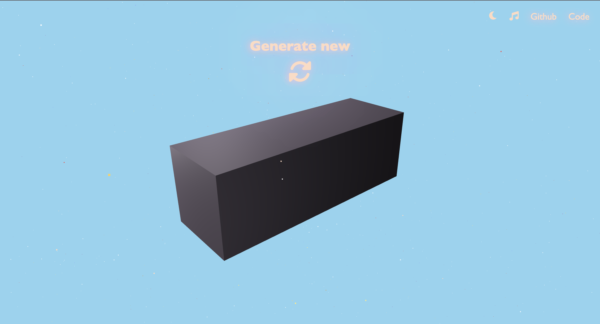
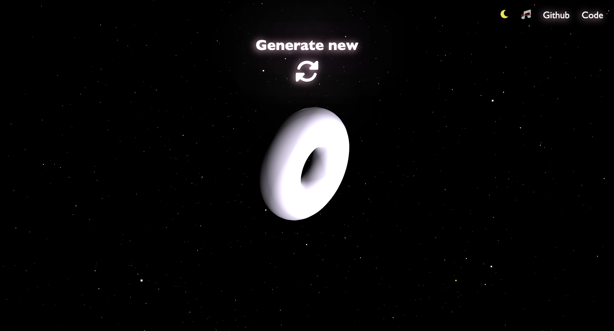

# Three.js Geometries Playground [Three-mesh]

Welcome to three-mesh, an interactive 3D web application that allows you to explore and create various geometries in a vibrant virtual environment. This project is a playful introduction to the world of 3D programming using the popular Three.js library. 

## Preview

  
  

## Features

- **Interactive 3D Environment**: Immerse yourself in a dynamic 3D space where you can manipulate and explore various geometries.
- **Geometry Generation**: Click the "Generate" button to spawn new and exciting geometries, each with its own unique characteristics.
- **Music Ambiance**: Toggle background music on or off with the music icon located in the top-right corner. Set the mood while you experiment!
- **Color Themes**: Enjoy two distinct color themes—light and dark modes—to suit your visual preference. Toggle between them using the theme switcher.
- **Responsive Design**: The application adapts to different screen sizes, making it accessible across a range of devices.
- **Source Code**: Dive into the source code to understand how different geometries are generated and interact with the Three.js library.

## Getting Started

1. Clone the repository: `git clone https://github.com/your-username/three-js-geometries-playground.git`
2. Navigate to the project directory: `cd three-js-geometries-playground`
3. Type npm run dev in your terminal / CLI
4. Open the localhost link

## Usage

- **Generate Geometries**: Click the "Generate" button to create new geometries. Experiment with shapes, sizes, and colors to your heart's content!
- **Music Toggle**: Turn on or off the background music by clicking the music icon. Groove to the beat as you explore the 3D world.
- **Color Themes**: Toggle between light and dark color themes by clicking the theme switcher button.
- **Mouse Interaction**: Hold down the mouse button and move to change the color of the generated geometry.
- **Touch Interaction**: On touch devices, tap and drag to create mesmerizing color transformations.

## Contributing

Contributions are welcome! If you'd like to enhance the project or fix any issues, feel free to open a pull request. Please ensure that your changes align with the project's goals and maintain its friendly and playful spirit.

## Acknowledgments

- This project was inspired by a passion for 3D programming and creativity.
- Special thanks to the [Three.js](https://threejs.org/) community for creating an amazing library that powers this playground.
- Background music provided by [Uppbeat](https://uppbeat.io). Background music track: Moonshine by Prigida.

## License

This project is licensed under the MIT License - see the  file for details.

## Contact

Got questions or feedback? Reach out to me on LinkedIn! [@allanheremi](https://linkedin.com/in/allanheremi). Let's connect and discuss all things Three.js!

Enjoy! 🚀🎉
